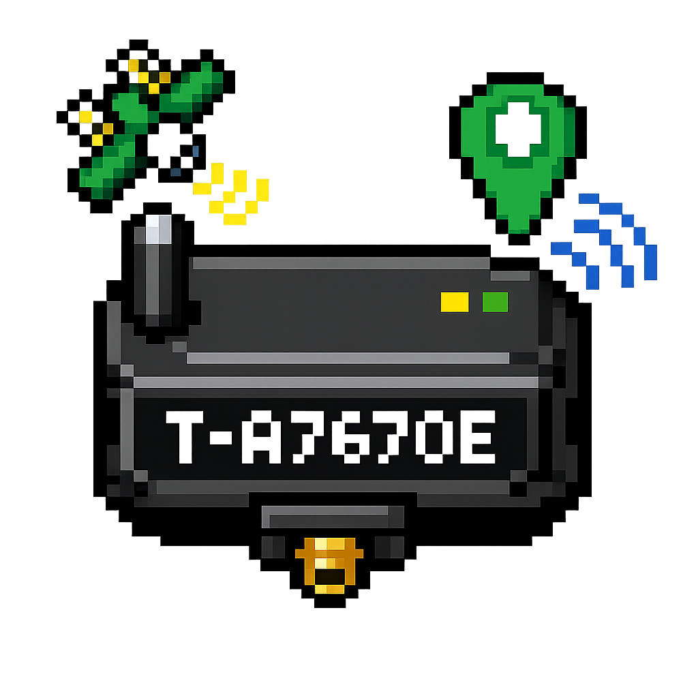

<p align="center">
  
</p>

<p align="center"><strong>Traccar client for LilyGO T-A7670E with PlatformIO</strong></p>

# T-A7670E Traccar Client

Versione `PlatformIO` basata sull'esempio ufficiale LilyGO `examples/Traccar` per `T-A7670E`.

## Base del progetto

- sorgente di riferimento: `Xinyuan-LilyGO/LilyGo-Modem-Series/examples/Traccar`
- board target: `LilyGO T-A7670E`
- framework: Arduino su PlatformIO
- modem target: `A7670E`

## Struttura

- `src/main.cpp`: porting dell'esempio ufficiale Traccar
- `src/utilities.h`: pinout e macro board per `T-A7670E`
- `config.h`: configurazione locale non versionata
- `config.example.h`: template pubblico

## Configurazione locale

`config.h` resta locale e non viene pushato.

Template attuale:

```cpp
#pragma once

#define TRACCAR_DEVICE_ID "your-device-id"
#define TRACCAR_URL "http://your-traccar-host:port/"

#define NETWORK_APN "your-apn"
#define GSM_PIN ""

#define USE_IPV6_ACCESS_POINT 0
#define DEBUG_SKETCH 1
// #define DUMP_AT_COMMANDS 1
```

## Build

```bash
pio run
```

Per selezionare una board diversa dall'ambiente di default:

```bash
pio run -e t-a7670e
pio run -e t-call-a7670-v1-0
pio run -e sim7000g
```

Gli ambienti `PlatformIO` ora coprono i `define` board-specific principali dell'esempio originale LilyGO.

## Upload

```bash
pio run -t upload
```

## Monitor seriale

```bash
pio device monitor -b 115200
```

## Note

- la base e' ora l'esempio ufficiale LilyGO, non piu' `sim7000-tracker`
- il trasporto verso Traccar usa `HTTP` semplice verso il server configurato in `config.h`
- il GNSS e' adattato via AT per la libreria `TinyGSM` ufficiale disponibile in PlatformIO
